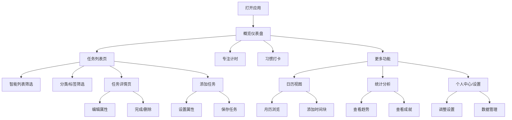

## 1. 产品概述

基于滴答清单（TickTick）的核心功能与界面设计理念，对 FocusFlow 移动端应用的全部界面进行重新设计与开发。新设计将融合 TickTick 的简洁高效交互模式与 FocusFlow 独有的专注时间管理特色，打造一款兼具任务管理与专注效率的移动端应用。

- 目标用户：需要高效任务管理与专注时间管理的知识工作者、学生和自由职业者
- 核心价值：将 TickTick 的任务管理体验与专注计时功能深度融合，提供流畅、美观、功能完整的移动端体验

## 2. 核心功能

### 2.1 用户角色

| 角色 | 注册方式 | 核心权限 |
|------|----------|----------|
| 普通用户 | 本地使用 | 浏览和使用全部功能 |

### 2.2 功能模块

1. **任务列表页**：分类视图、标签筛选、优先级排序、快速添加、智能列表
2. **任务详情页**：标题编辑、描述、截止日期、提醒设置、优先级、标签、子任务、重复规则
3. **添加/编辑任务界面**：底部抽屉式面板、快捷操作、智能输入
4. **日历视图**：月历/周日程切换、日程时间线、任务标记
5. **统计分析页**：专注趋势、任务完成率、习惯达成、成就徽章
6. **个人中心/设置页**：主题切换、专注设置、数据管理、账户信息
7. **概览仪表盘**：今日概览、快捷入口、专注状态、待办摘要

### 2.3 页面详情

| 页面名称 | 模块名称 | 功能描述 |
|----------|----------|----------|
| 任务列表页 | 智能列表切换 | 支持"全部/今天/最近7天/星标/已完成"等智能列表快速切换，显示对应任务数量 |
| 任务列表页 | 分类与标签筛选 | 按项目分类筛选，按标签筛选，支持多条件组合 |
| 任务列表页 | 任务卡片列表 | 显示任务标题、优先级色标、截止日期、项目归属、标签、子任务进度、重复标记 |
| 任务列表页 | 快速添加栏 | 底部常驻快速添加输入框，支持设置优先级、日期后直接添加 |
| 任务列表页 | 排序与分组 | 按优先级/日期/项目排序，支持分组折叠显示 |
| 任务详情页 | 标题与描述 | 可编辑标题和详细描述 |
| 任务详情页 | 优先级选择 | 四级优先级（紧急/高/中/低），带颜色标识 |
| 任务详情页 | 日期与提醒 | 截止日期选择、逾期提示、提醒时间设置 |
| 任务详情页 | 项目与标签 | 项目归属选择、多标签选择 |
| 任务详情页 | 子任务管理 | 添加/完成/删除子任务，显示完成进度 |
| 任务详情页 | 重复规则 | 每日/每周/每月重复设置 |
| 任务详情页 | 番茄钟预估 | 设置预计番茄数，显示已完成番茄数 |
| 任务详情页 | 操作按钮 | 完成/恢复/删除/归档操作 |
| 添加任务界面 | 底部抽屉 | 从底部滑出的半屏面板，包含所有任务属性设置 |
| 添加任务界面 | 快捷属性栏 | 日期/优先级/项目/重复的快捷选择按钮行 |
| 添加任务界面 | 详细设置区 | 展开的完整属性设置区域 |
| 日历视图 | 月历网格 | 带任务标记点的月历，支持左右滑动切换月份 |
| 日历视图 | 选中日期详情 | 显示选中日期的任务、时间块、纪念日列表 |
| 日历视图 | 添加时间块 | 浮动按钮添加时间块，设置时间段和类型 |
| 统计分析页 | 时间范围切换 | 本周/本月/本年数据切换 |
| 统计分析页 | 核心指标卡片 | 专注时长、完成任务数、连续天数、效率评分 |
| 统计分析页 | 专注趋势图 | 柱状图展示每日/每月专注时长趋势 |
| 统计分析页 | 时段分布图 | 24小时专注时段热力分布 |
| 统计分析页 | 项目时间分布 | 各项目时间占比进度条 |
| 统计分析页 | 智能洞察 | 最佳专注时段、最佳工作日、习惯完成率 |
| 统计分析页 | 成就徽章 | 已达成/未达成成就展示，含进度条 |
| 个人中心/设置页 | 个人信息卡片 | 用户头像、等级、积分展示 |
| 个人中心/设置页 | 外观设置 | 主题模式切换（浅色/深色/跟随系统）、声音提醒开关 |
| 个人中心/设置页 | 专注设置 | 专注时长、短休息、每日目标调整 |
| 个人中心/设置页 | 数据管理 | 数据统计概览、导出/导入、回收站 |
| 个人中心/设置页 | 危险操作 | 清除所有数据（需二次确认） |
| 概览仪表盘 | 问候与日期 | 根据时段显示问候语，显示当前日期 |
| 概览仪表盘 | 核心数据卡片 | 今日专注时长、已完成任务、连续天数、效率评分 |
| 概览仪表盘 | 专注进行中 | 专注计时器运行时显示状态卡片 |
| 概览仪表盘 | 今日待办 | 紧急任务和今日任务列表预览 |
| 概览仪表盘 | 今日习惯 | 习惯打卡横向滚动卡片 |

## 3. 核心流程

用户打开应用 → 概览仪表盘展示今日概要 → 点击任务Tab进入任务列表 → 通过智能列表/分类/标签筛选任务 → 点击任务查看详情或编辑 → 点击"+"快速添加任务 → 切换到日历查看日程安排 → 切换到统计查看数据 → 进入设置调整偏好

## 4. 用户界面设计

### 4.1 设计风格

- **设计理念**：融合 TickTick 的清爽简洁与 FocusFlow 的专注质感，打造"轻量高效、温暖专注"的移动端体验
- **主色调**：以深靛蓝（#4F46E5）为主色，搭配温暖的琥珀色（#F59E0B）作为强调色，营造专业而不失温度的视觉感受
- **辅助色系**：
  - 优先级色：紧急-红色(#EF4444)、高-橙色(#F97316)、中-蓝色(#3B82F6)、低-灰色(#9CA3AF)
  - 功能色：成功-翠绿(#10B981)、警告-琥珀(#F59E0B)、信息-天蓝(#06B6D4)
- **按钮风格**：圆角胶囊按钮（rounded-full），主操作使用填充色，次操作使用描边或浅色背景
- **字体**：标题使用系统默认粗体，正文使用系统默认常规体；数字使用等宽风格展示数据
- **布局风格**：卡片式布局，圆角2xl（16px），间距4px倍数，底部Tab导航
- **图标风格**：使用 Lucide 线性图标，2px 描边宽度，与文字等高对齐
- **动效**：页面切换使用淡入淡出，按钮点击使用缩放反馈（active:scale-95），列表项使用交错动画入场

### 4.2 页面设计概述

| 页面名称 | 模块名称 | UI元素 |
|----------|----------|--------|
| 任务列表页 | 智能列表切换 | 水平滚动药丸标签，选中态填充主色，显示任务计数徽章 |
| 任务列表页 | 分类筛选栏 | 项目色标+名称的下拉选择器，选中态带主色背景 |
| 任务列表页 | 任务卡片 | 左侧优先级色条，圆形勾选框，标题+元信息行，右侧星标和更多按钮 |
| 任务列表页 | 快速添加栏 | 底部固定栏，左侧优先级色点切换，中间输入框，右侧发送按钮 |
| 任务详情页 | 底部抽屉 | 圆角顶部手柄，标题输入，属性分组（优先级/日期/项目/标签/备注/子任务/重复/番茄），底部操作按钮 |
| 添加任务界面 | 底部抽屉 | 与详情页同构，顶部标题输入，快捷属性按钮行，展开详细设置 |
| 日历视图 | 月历网格 | 7列网格，今日高亮，选中日期主色填充，底部任务标记点 |
| 日历视图 | 日程列表 | 时间块卡片（带类型色标），任务卡片（带优先级色点），纪念日卡片（渐变背景） |
| 统计分析页 | 指标卡片 | 2x2网格，图标+标签+大数字，带浅色背景图标容器 |
| 统计分析页 | 趋势图 | 纵向柱状图，今日柱体高亮，底部标签 |
| 统计分析页 | 成就徽章 | 3列网格，圆形图标+名称+描述，未达成灰度+进度条 |
| 个人中心/设置页 | 个人卡片 | 顶部渐变背景，头像+等级+积分 |
| 个人中心/设置页 | 设置分组 | 分组标题+圆角卡片容器，行内设置项，右侧值或开关 |
| 概览仪表盘 | 问候区 | 大字问候语+日期，温暖色调 |
| 概览仪表盘 | 数据卡片 | 2x2网格卡片，图标容器+标签+数值+进度条 |
| 概览仪表盘 | 待办列表 | 紧急任务红色边框卡片，普通任务浅色卡片 |

### 4.3 响应式适配

- 移动优先设计，适配 320px-428px 宽度范围
- 底部安全区域适配（safe-area-inset-bottom）
- 顶部安全区域适配（safe-area-inset-top）
- 触摸优化：所有可点击元素最小44px触摸区域，active:scale缩放反馈
- 横向滚动区域隐藏滚动条（scrollbar-width: none）
- 长内容区域使用固定高度+内部滚动

### 4.4 3D场景指导

不适用
