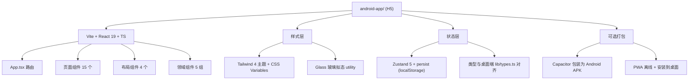

## 1. 架构设计

新模块 `android-app/` 独立于现有 `android/`（Capacitor 壳）与桌面端代码，是一套**纯前端、可打包为 Android App** 的 H5 设计稿：



## 2. 技术选型

| 维度   | 选择                                 | 理由                        |
| ---- | ---------------------------------- | ------------------------- |
| 构建工具 | **Vite 5**                         | 启动快，构建产物小，便于 Capacitor 打包 |
| 框架   | **React 19 + TypeScript**          | 与桌面端同栈，类型可对齐              |
| 样式   | **Tailwind CSS 4 + CSS Variables** | 主题切换友好，与 PRD 色板一致         |
| 状态   | **Zustand 5 + persist**            | 与桌面端一致，localStorage 持久化   |
| 路由   | **React Router 6**                 | 移动端多页面切换                  |
| 图标   | **Lucide React**                   | 与桌面端一致                    |
| 动效   | **Framer Motion 11**               | 抽屉/页面切换/粒子效果              |
| 图表   | **Recharts**                       | 桌面端已使用，统计页直接用             |
| 日期   | **date-fns**                       | 桌面端已使用                    |
| 包大小  | 目标 gzip 后 < 200KB                  | Capacitor 启动速度            |

## 3. 路由定义

| 路径               | 页面            | Tab    |
| ---------------- | ------------- | ------ |
| `/`              | Dashboard     | 概览     |
| `/tasks`         | Tasks         | 任务     |
| `/focus`         | Focus         | 专注     |
| `/habits`        | Habits        | 习惯     |
| `/me`            | Settings      | 我的     |
| `/more`          | MoreGrid      | 我的（子页） |
| `/calendar`      | Calendar      | 更多     |
| `/time-block`    | TimeBlock     | 更多     |
| `/goals`         | Goals         | 更多     |
| `/anniversaries` | Anniversaries | 更多     |
| `/journal`       | Journal       | 更多     |
| `/analytics`     | Analytics     | 更多     |
| `/task/:id`      | TaskDetail    | 浮层     |
| `/task/new`      | AddTask       | 浮层     |
| `/search`        | Search        | 浮层     |
| `/notifications` | Notifications | 浮层     |

## 4. 核心组件

### 4.1 布局

| 组件            | 职责                               |
| ------------- | -------------------------------- |
| `StatusBar`   | 顶部 44dp 系统状态栏（时间 / 信号 / 电量 mock） |
| `AppHeader`   | 应用头：返回 / 标题 / 操作；玻璃背景            |
| `TabBar`      | 底部 5 项 Tab + 中间凸起「专注」按钮          |
| `MoreGrid`    | 9 宫格二级入口                         |
| `BottomSheet` | 通用底部抽屉（任务详情/添加）                  |
| `SafeArea`    | 处理顶部 / 底部安全区                     |

### 4.2 任务

| 组件                                                                    | 用途                              |
| --------------------------------------------------------------------- | ------------------------------- |
| `TaskListFilter`                                                      | 水平药丸标签：全部 / 今天 / 即将 / 星标 / 已完成  |
| `TaskCard`                                                            | 任务卡（优先级色条 / 勾选 / 标题 / 元信息 / 星标） |
| `QuickAddBar`                                                         | 底部快速添加（优先级切换 + 输入 + 提交）         |
| `TaskDetailSheet`                                                     | 任务详情抽屉                          |
| `PrioritySelector` / `DatePicker` / `TagSelector` / `ProjectSelector` | 属性选择器                           |

### 4.3 专注

| 组件               | 用途               |
| ---------------- | ---------------- |
| `FocusRing`      | SVG 圆环进度 + 中心大数字 |
| `ModeSwitcher`   | 专注 / 短休 / 长休 药丸  |
| `TaskLink`       | 关联任务下拉           |
| `WhiteNoiseGrid` | 9 宫格白噪音          |
| `DistractionLog` | 分心记录             |

### 4.4 习惯 / 统计

| 组件                | 用途                |
| ----------------- | ----------------- |
| `HabitCard`       | 习惯卡 + 连续天数 + 今日按钮 |
| `WeekDots`        | 7 日打卡点            |
| `StatCard`        | 2×2 指标卡           |
| `TrendBar`        | 专注时长柱状图           |
| `HourHeatmap`     | 24 小时热力           |
| `AchievementWall` | 3 列成就             |

## 5. 状态管理

```typescript
// store/useStore.ts
interface AppState {
  activeTab: 'dashboard' | 'tasks' | 'focus' | 'habits' | 'me'
  theme: 'light' | 'dark' | 'system'
  tasks: Task[]
  projects: Project[]
  tags: Tag[]
  habits: Habit[]
  habitLogs: Record<string, string[]>   // habitId -> [dateISO, ...]
  pomodoroSessions: PomodoroSession[]
  timeBlocks: TimeBlock[]
  anniversaries: Anniversary[]
  goals: Goal[]
  journalEntries: JournalEntry[]
  notifications: Notification[]
  focus: {
    mode: 'focus' | 'short' | 'long'
    isRunning: boolean
    remainingSec: number
    linkedTaskId?: string
    whiteNoise?: string
  }
  // actions ...
}
```

持久化：`persist` 中间件 + `localStorage`，key = `focusflow-android-v1`。

## 6. 样式系统

### 6.1 CSS Variables

```css
:root {
  --bg: #eaf0f6;
  --ink: #1d2230;
  --muted: #7a8194;
  --blue: #2b6df0;
  --blue-2: #4a8af7;
  --blue-soft: #e8f0ff;
  --card: #ffffff;
  --green: #22c55e;
  --orange: #f59e0b;
  --red: #ef4444;
  --shadow-sm: 0 4px 12px -4px rgba(20,30,60,.08);
  --shadow-md: 0 10px 30px -10px rgba(20,30,60,.18);
  --shadow-phone: 0 40px 80px -30px rgba(20,30,60,.35);
  --radius-card: 18px;
  --radius-btn: 14px;
}
[data-theme="dark"] {
  --bg: #0f1419;
  --card: #1a1f2e;
  --ink: #f1f5f9;
  --muted: #94a3b8;
  --blue-soft: rgba(43,109,240,.16);
}
```

### 6.2 工具类

* `.glass` / `.glass-strong`：玻璃背景

* `.safe-top` / `.safe-bottom`：安全区

* `.text-num`：`tabular-nums` 等宽数字

* `.scrollbar-hide`：隐藏滚动条

## 7. 关键交互

| 交互     | 实现                                                             |
| ------ | -------------------------------------------------------------- |
| 番茄钟计时  | `setInterval` + `requestAnimationFrame` 平滑进度环                  |
| 抽屉     | Framer Motion `AnimatePresence` + `cubic-bezier(.2,.8,.2,1)`   |
| 列表入场   | IntersectionObserver + `style={{ animationDelay: i*40+'ms' }}` |
| 主题切换   | 写入 `data-theme` + 监听系统                                         |
| Tab 切换 | React Router + 状态栏颜色同步                                         |

## 8. Android 打包路径

* **方案 A（推荐）**：Capacitor 包装（项目已具备 `capacitor.config.ts` 与 `android/`）

  * `npx cap add android`（已存在）

  * `npx cap copy android`

  * 在 `android/app/src/main/assets/public` 放入 `android-app/dist` 产物

  * 修改 `MainActivity` 加载 `file:///android_asset/public/index.html`

* **方案 B**：TWA / PWA standalone 添加到桌面

## 9. 性能预算

| 指标     | 目标                  |
| ------ | ------------------- |
| 首屏 LCP | < 1.5s（Android 中端机） |
| 交互 FID | < 100ms             |
| 包大小    | < 200KB gzip        |
| 主线程长任务 | 无 > 50ms            |

## 10. 开发顺序

1. 脚手架：Vite + React + TS + Tailwind + 路由 + Zustand
2. 布局：StatusBar / AppHeader / TabBar / BottomSheet
3. 全局样式 + 主题
4. 数据 mock（基于桌面端 types 写种子数据）
5. 页面：Dashboard → Tasks → Focus → Habits → MoreGrid → 各 More 子页
6. 浮层：TaskDetail / Search / Notifications
7. 动效与微交互
8. 浅/深主题
9. 构建并验证

