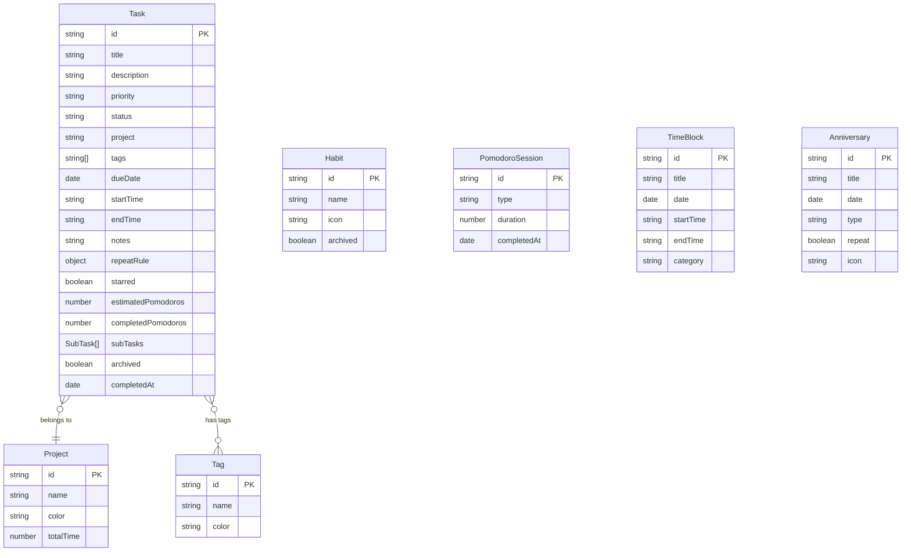

## 1. 架构设计

本项目为纯前端应用，基于现有 Next.js 项目架构，仅对移动端视图层进行重新设计。数据层和业务逻辑层保持不变，仅重构 UI 组件层。

```mermaid
flowchart TD
    A["移动端应用层"] --> B["页面组件层"]
    B --> B1["MobileApp 主框架"]
    B --> B2["MobileDashboardView"]
    B --> B3["MobileTasksView"]
    B --> B4["MobileCalendarView"]
    B --> B5["MobileAnalyticsView"]
    B --> B6["MobileSettingsView"]
    B --> B7["MobileFocusView"]
    B --> B8["MobileHabitsView"]
    A --> C["共享组件层"]
    C --> C1["TaskCard"]
    C --> C2["PrioritySelector"]
    C --> C3["TagSelector"]
    C --> C4["DatePicker"]
    C --> C5["BottomSheet"]
    C --> C6["StatCard"]
    A --> D["状态管理层"]
    D --> D1["Zustand Store"]
    D --> D2["自定义 Hooks"]
    A --> E["样式层"]
    E --> E1["Tailwind CSS"]
    E --> E2["CSS Variables"]
    E --> E3["Glass Morphism"]
```

## 2. 技术说明

* **前端框架**：Next.js 16 + React 19 + TypeScript

* **样式方案**：Tailwind CSS 4 + CSS Variables（主题色）

* **状态管理**：Zustand 5（已有 store，保持不变）

* **UI组件库**：Radix UI + shadcn/ui（已有组件，保持不变）

* **图标库**：Lucide React

* **图表**：Recharts（已有依赖）

* **动画**：CSS Transitions + Tailwind 动画类

* **后端**：无（纯前端，数据存储在 localStorage）

* **数据库**：无（使用 Zustand persist 中间件持久化到 localStorage）

## 3. 路由定义

本项目为单页应用，移动端视图通过 Tab 切换而非路由切换：

| 视图ID          | 用途    | 组件                      |
| ------------- | ----- | ----------------------- |
| dashboard     | 概览仪表盘 | MobileDashboardView     |
| tasks         | 任务列表  | MobileTasksView         |
| focus         | 专注计时  | MobileFocusView         |
| habits        | 习惯打卡  | MobileHabitsView        |
| calendar      | 日历视图  | MobileCalendarView      |
| goals         | 目标管理  | MobileGoalsView         |
| anniversaries | 纪念日   | MobileAnniversariesView |
| journal       | 日记    | JournalView             |
| analytics     | 统计分析  | MobileAnalyticsView     |
| settings      | 设置    | MobileSettingsView      |

## 4. API定义

无后端API，所有数据操作通过 Zustand Store 完成。

## 5. 服务器架构图

不适用（纯前端项目）

## 6. 数据模型

### 6.1 数据模型定义

数据模型已在现有 Store 中定义，本次重构不修改数据模型，仅重构 UI 展示层。

### 6.2 数据定义语言

不适用（使用 Zustand Store 内存数据结构，通过 persist 中间件序列化到 localStorage）

## 7. 重构策略

### 7.1 文件组织

所有移动端视图组件位于 `components/views/mobile/` 目录下，保持现有目录结构不变，仅替换组件内容。

### 7.2 组件拆分原则

* 每个视图组件保持在 300 行以内

* 提取可复用的子组件到 `components/mobile/` 目录

* 共享的 UI 模式（如底部抽屉、任务卡片）提取为独立组件

### 7.3 新增共享组件

| 组件名                 | 用途         | 位置                                          |
| ------------------- | ---------- | ------------------------------------------- |
| MobileTaskCard      | 任务列表中的任务卡片 | components/mobile/mobile-task-card.tsx      |
| MobileBottomSheet   | 通用底部抽屉面板   | components/mobile/mobile-bottom-sheet.tsx   |
| MobilePriorityDot   | 优先级色点指示器   | components/mobile/mobile-priority-dot.tsx   |
| MobileStatCard      | 统计数据卡片     | components/mobile/mobile-stat-card.tsx      |
| MobileEmptyState    | 空状态占位组件    | components/mobile/mobile-empty-state.tsx    |
| MobileSectionHeader | 分组标题组件     | components/mobile/mobile-section-header.tsx |

### 7.4 样式系统

* 使用 CSS Variables 定义主题色，支持深色模式切换

* Glass Morphism 效果通过 `glass-card`、`glass-sheet`、`glass-header`、`glass-nav` 等现有工具类实现

* 新增移动端专用 CSS 类：

  * `.safe-area-top`：顶部安全区域 padding

  * `.safe-area-bottom`：底部安全区域 padding

  * `.touch-manipulation`：禁用双击缩放

